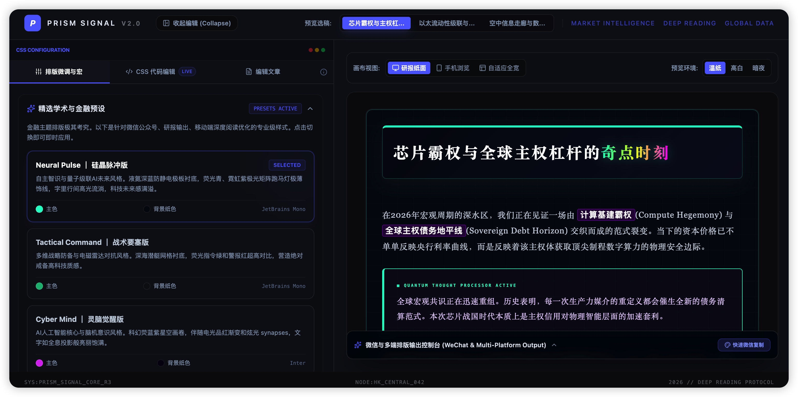

# Prism Signal v2.0 ｜ 棱镜信号：专业金融与深度阅读排版微调器

> **Prism Signal** 是一款专为金融研报、深度阅读、商业洞察以及微信公众号排版设计的交互式 CSS 样式微调与内容预览平台。通过深度结合学术严谨美感与前沿数字科技风，Prism Signal 助力创作者打造视觉一流水准、体验舒适且排版专业的长文。

---

## 📸 应用预览



---

## ✨ 核心特性

1. **多端仿真预览画布**
   - **研报纸面 (Desktop)**：模拟专业 A4 纸张、学术白皮书与出版级 PDF 排版宽度，适合大屏精细化调整。
   - **手机浏览 (Mobile)**：精确仿真智能手机竖屏（如微信公众号文章），完美把控移动端字号、行宽与段落间距。
   - **自适应全宽 (Fluid)**：页面随视口自动伸缩，实现流式排版设计。

2. **多环境背景色切换 (温纸/高白/暗夜)**
   - **温纸本底**：采用专业出版级的温和护眼纸黄色底色，减轻长时间校对造成的眼部疲劳。
   - **高白本**：高对比度的纯白色背景，对应最标准的网络阅读环境。
   - **暗极夜**：沉浸式的深色主题，完美还原暗黑模式下的色彩与对比度表现。

3. **智能预设样式套件**
   - **Neural Pulse (硅晶脉冲版)**：科技感满溢的外设、双边荧光青或霓虹紫高亮线、充满神秘感与数码风格的专属中英文代码字体配比。
   - **Tactical Command (战术要塞版)**：更具硬朗工业风的主题，高对比度的警告红或战阵绿，严谨而充满力量感的线条框架。
   - **Cyber Mind (灵脑觉醒版)**：富含 AI 与科幻感的风格，冷艳深沉的渐变亮色点缀，优雅的非对称布局元素。

4. **实时 CSS 与文章编辑**
   - **CSS 代码编辑 (LIVE)**：配备支持实时热重载更新的高性能样式编辑器，每一行样式更改都将毫秒级体现在预览画布中。
   - **文章大纲与内容自定**：支持直接编辑文章富文本 HTML 与 Markdown，满足即时内容创作与版面校正需求。

5. **一键公众号排版导出 (零重设粘贴)**
   - **一键复制 (WeChat Copy)**：采用自定义的 inline-style 行内样式编译引擎，点击“快速微信复制”按钮即自动将带有全套精心设计的 CSS 样式的富文本存入剪贴板。
   - **完美无缝粘贴**：直接在微信公众号后台、知乎、语雀、少数派等富文本编辑器中直接粘贴 `(Ctrl + V)`，完全杜绝样式丢失、溢出或字体变形的问题。

---

## 🚀 快速开始

本项目由 **React 18 + Vite** 强力驱动，已配置完备的自动化脚本，支持本地开发与 GitHub Pages 部署发布。

### 1. 安装依赖

```bash
npm install
```

### 2. 本地开发与调试

启动本地开发服务器（支持热重载 HMR）：

```bash
npm run dev
```

打开浏览器访问 [http://localhost:3000](http://localhost:3000) 即可开始使用。

### 3. 构建打包

编译生产环境静态文件（输出至 `dist/` 目录）：

```bash
npm run build
```

---

## 📖 详细使用指南

### 第一步：精选稿件预览

在顶部导航栏的 **“预览选稿”** 中，可以快速切换预设的深度金融与科技专题研报，例如：

- 《芯片霸权与全球主权杠杆的奇点时刻》：体验复杂双语、图表与引用块的多重混排。
- 《以太流动性级联与暗地资本的算法重置》：体验纯学术性表格布局与大量脚注标记。
- 《空中信息走廊与数字重演的无人机编队》：体验长文在自适应画布下的排版张力。

### 第二步：配置并微调排版样式

点击左侧主控制台在 **“排版微调与宏”** 选项卡下，选择您最偏好的美学预设（如 _Neural Pulse_ 或 _Tactical Command_）。

- 您可以直接在卡片点击切换，页面将会瞬间适配新的主色调（Primary）、背景点缀与专属字体。
- 您可以展开 **"预设配置参数"** 观察当前的变量分布。

### 第三步：手动修改 CSS (高级进阶)

切换至左侧 **“CSS 代码编辑”** 面板：

- 直接在文本域中对排版类进行样式手写扩充（例如修改标题类 `#wenyan h2` 的 `border-bottom`、`letter-spacing` 或段落行高 `line-height` 等）。
- 编辑器完美捕获输入活动，停止输入即时编译应用。

### 第四步：修改并编辑文章

如果您想排版您自己的文章内容：

- 切换至左侧 **“编辑文章”** 选项卡。
- 在输入区贴入您自己的 HTML 排版。
- 预览区会实时根据当前的 CSS 排版渲染您的图文。

### 第五步：微信排版导出与多端分发

在右侧的预览容器底部，可以展开 **“微信与多端排版输出控制台”**。

1. **背景色微调（Floating Slider）**：您可以单独调整预览背景的温和纸黄色配比，使其高度迎合您的个人屏幕状态。
2. **快速微信复制**：点击右侧高亮的 **“快速微信复制 (Quick copy)”**，应用将：
   - 自动抓取预览容器中具有指定样式的完全渲染 DOM。
   - 将所有的外联、块级、行内 CSS 重写并编译成高兼容性的微信专用 `style="..."` 结构。
   - 通过浏览器的 Clipboard API 完美复制。
3. **无痛发布**：直接在微信公众号后台的正文编辑框使用快捷键粘帖 `(Ctrl/Cmd + V)`，您的文章便可以在公众号上完美重现 Prism Signal 的排版设计！

---

## 🛠️ GitHub Pages 自动部署配置

项目已完整集成了 **GitHub Actions** 自动化部署工作流。当您将代码推送至 `main` 分支时，无需手动操作，系统将自动编译代码并将静态页面部署到对应的 GitHub Pages 地址上。

### 自动部署配置文件

具体工作流配置位于 `.github/workflows/deploy.yml`：

```yaml
name: Deploy to GitHub Pages

on:
  push:
    branches:
      - main

permissions:
  contents: read
  pages: write
  id-token: write

concurrency:
  group: pages
  cancel-in-progress: true

jobs:
  build:
    runs-on: ubuntu-latest
    steps:
      - uses: actions/checkout@v4
      - uses: actions/setup-node@v4
        with:
          node-version: 20
      - run: npm install
      - run: npm run build
      - uses: actions/upload-pages-artifact@v3
        with:
          path: ./dist

  deploy:
    needs: build
    runs-on: ubuntu-latest
    environment:
      name: github-pages
      url: ${{ steps.deployment.outputs.page_url }}
    steps:
      - id: deployment
        uses: actions/deploy-pages@v4
```

### GitHub 配置指南

1. 将您的项目代码推送至 GitHub 仓库。
2. 进入您的 GitHub 仓库设置：**Settings -> Pages**。
3. 在 **Build and deployment** 下的 **Source** 选项中，拉下菜单选择 **GitHub Actions**。
4. 现在，每次对 `main` 分支执行 `git push` 时，您的最新排版微调器就会自动部署发布上线！

---

## 🎨 艺术指导与排版美学

Prism Signal 坚信深度阅读的载体理应具备以下美学设计：

- **字偶间距 (Tracking & Kerning)**: 专为金融名词、中英文交叉排版与带有括号的词条设定高比例的微调字距和流畅行宽。
- **双语混排平衡 (Bilingual Balance)**: 精选英文字体（如 _JetBrains Mono_ 或 _Courier_）与中文字体（如 _苹方-简_、_微软雅黑_）在不同字重下的完美共存比例。
- **舒适呼吸感 (Vapor & Breathing space)**: 拒绝无缝紧贴，对任何引用块、警告栏、图片备注提供舒适的侧深与外间边。
